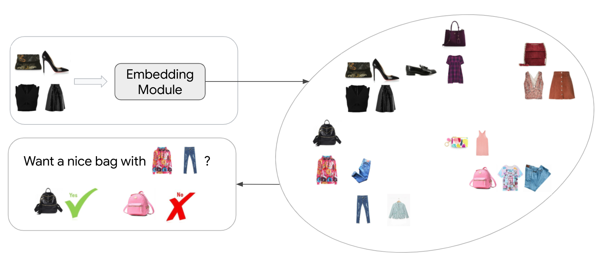
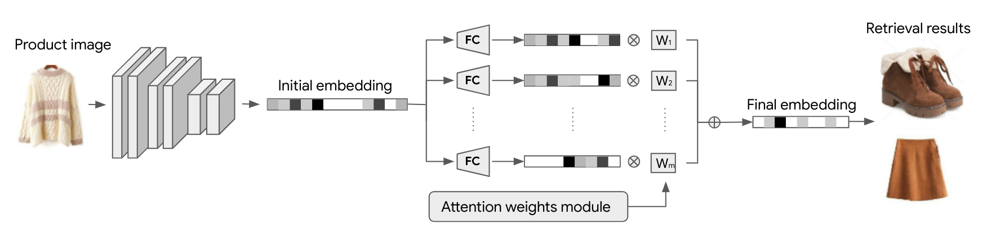
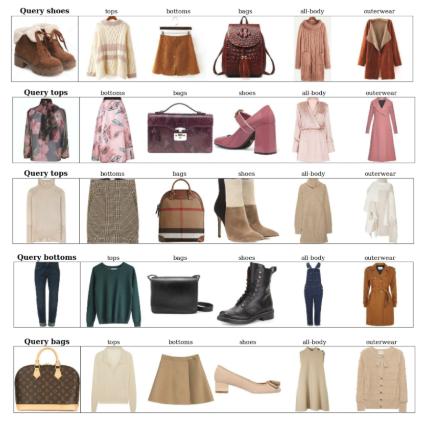

# Complete the Look

This project aims to build a model that can recommend complementary clothes for an apparel item in terms of style and functionality compatibilities.

To this end, we build an embedding module that can embed product images into a compatibility embedding space and later we can use this embedding space to retrieve compatible products with k-nearest neighbors.



Our embedding module projects product initial embeddings into serveral subspaces and integrates these subspaces with attention weights learned from an attention weights module. The final integrated embeddings are used for retrieval purposes.



## Training

Our embedding module is trained use the [Polyvore Outfit Dataset](https://github.com/mvasil/fashion-compatibility). Several key arguments are:

```shell

--embed_input: Whether to use initial product color and pattern embeddings as input instead of product images
--n_mask: The number of subspaces to use
--cond_input: Inputs to the attention weights module. select 'none' to use average weights.
--margin: Margin values to be used in triplet loss
--batch_mining: Whether to use average triplet loss ('normal') or semihard triplet loss ('semihard') etc.
```

You can see a full list and descriptions of the model options by:

``` shell
python main.py --help
```

For example, the following command will train a model with 5 subspaces using initial product color and pattern embeddings as inputs. The attention weights will be set to average weights. Triplet loss will be calculated using semihard negatives.


``` shell
python main.py --batch-size 128 --l2_embed --embed_input --margin 0.1 --n_masks 5 --cond_input none --batch_mining semihard 
```


## Testing

To test an embedding module for the compatibility prediction task and the fill-in-the-blank task proposed by [Vasileva et al. 2018](https://github.com/mvasil/fashion-compatibility), `--test` argument needs to be included. For example, to test a model trained with average attention weights and 5 subspaces, you can use:

``` shell
python main.py --test --exp_id {Experiment_ID} --l2_embed --embed_input --n_masks 5 --cond_input none
```


## Results visualization

We visualize the compatible product retrieval results using our model in the provided .ipynb file. You can find more visualizations on this [html file](complete_the_look_upated_demo.html).



### License

    Copyright 2020 Google LLC

    Licensed under the Apache License, Version 2.0 (the "License");
    you may not use this file except in compliance with the License.
    You may obtain a copy of the License at

        https://www.apache.org/licenses/LICENSE-2.0

    Unless required by applicable law or agreed to in writing, software
    distributed under the License is distributed on an "AS IS" BASIS,
    WITHOUT WARRANTIES OR CONDITIONS OF ANY KIND, either express or implied.
    See the License for the specific language governing permissions and
    limitations under the License.
